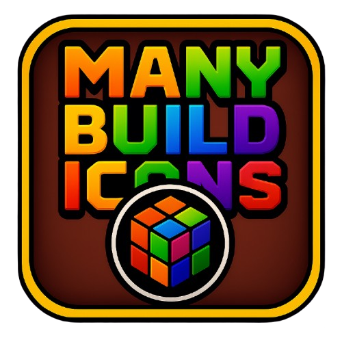

# Many Build Icons

A Geometry Dash mod that allows you to save and manage multiple player icon configurations.

## 📋 Description

**Many Build Icons** is a mod that lets you create and save different icon profiles for your character in Geometry Dash. Instead of having to manually change each icon every time you want to use a different configuration, you can save your favorite combinations and switch them with a single click.

## ✨ Features

- **Save icon profiles**: Save your current icon configuration as a customizable profile
- **Multiple profiles**: Create as many profiles as you want with different combinations
- **Quick switching**: Switch between profiles with a single click
- **Intuitive interface**: Easy-to-use button in the Garage (icon menu)
- **Persistence**: Your profiles are automatically saved and persist between sessions

## 🎮 How to use

1. **Access the mod**: Go to the Garage (icon menu) in Geometry Dash
2. **Create profile**: Click on the profile button (special icon) in the top right corner
3. **Save current configuration**: Use the "+" button to save your current icon configuration
4. **Name profile**: Give your profile a descriptive name
5. **Switch profiles**: Select any saved profile to instantly apply that configuration
6. **Manage profiles**: Delete profiles you no longer need

## 🎨 Saved icons

The mod saves the following information for each profile:
- **Basic icons**: Cube, Ship, Ball, UFO, Wave, Robot, Spider, Swing
- **Effects**: Jetpack (Ship Fire)
- **Colors**: Primary color, secondary color, glow and glow color
- **Death effects**: Death effect

## 🤝 Contributing

If you want to contribute to the project:
1. Fork the repository
2. Create a feature branch (`git checkout -b feature/new-feature`)
3. Commit your changes (`git commit -am 'Add new feature'`)
4. Push to the branch (`git push origin feature/new-feature`)
5. Open a Pull Request

## 📝 License

This project is under the MIT license. See the LICENSE file for more details.

## 🐛 Reporting issues

If you find a bug or have a suggestion, please:
1. Check if a similar issue already exists
2. Create a new issue with a detailed description of the problem
3. Include information about your Geometry Dash and Geode versions

## 🔗 Useful links

- [Geode SDK Documentation](https://docs.geode-sdk.org/)
- [Geode Source Code](https://github.com/geode-sdk/geode/)
- [Geode CLI](https://github.com/geode-sdk/cli)
- [Bindings](https://github.com/geode-sdk/bindings/)
- [Dev Tools](https://github.com/geode-sdk/DevTools)

---

**Developed by rompni** 🎮
