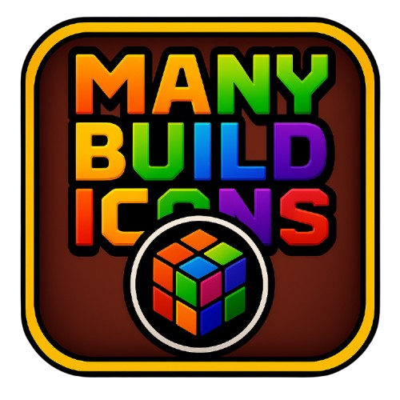

# Many Build Icons

A Geometry Dash mod that allows you to save and manage multiple player icon configurations.

## 📋 Description

**Many Build Icons** is a mod that lets you create and save different icon profiles for your character in Geometry Dash. Instead of having to manually change each icon every time you want to use a different configuration, you can save your favorite combinations and switch them with a single click.

## ✨ Features

- **Save icon profiles**: Save your current icon configuration as a customizable profile
- **Multiple profiles**: Create as many profiles as you want with different combinations
- **Quick switching**: Switch between profiles with a single click
- **Intuitive interface**: Easy-to-use button in the Garage (icon menu)
- **Persistence**: Your profiles are automatically saved and persist between sessions